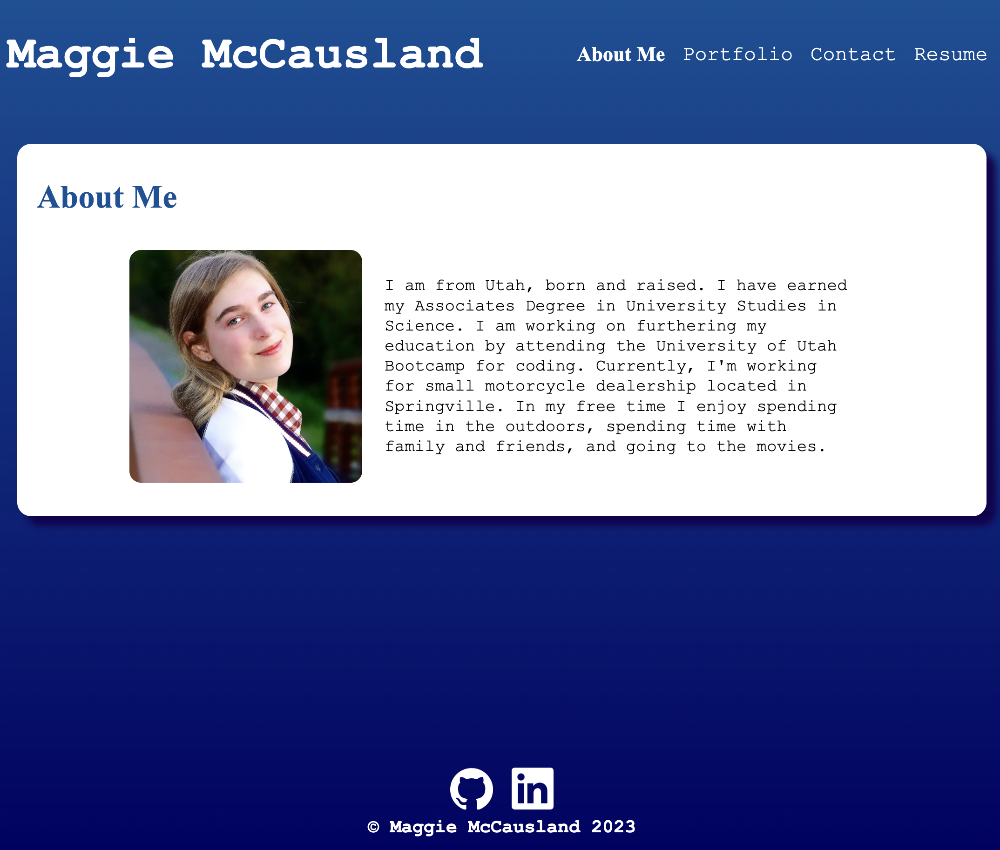

# React + Vite Portfolio

## Table of Contents
- [Description](#description)
- [Screenshot and Portfolio](#screenshot-and-portfolio)
- [Contributors](#contributors)
- [License](#license)
- [Questions](#questions)

## Description
As a web developer I want a React portfolio that contains my work samples, a resume, and contact information for potential empoyers to access and review.

## Screenshot and Portfolio
  [Click to view deployed App on Netlify](https://mccausland-portfolio.netlify.app/) 
  

## Contributors
Show your appreciation to those who have contributed to the project. Also state if you are open to contributions and what your requirements are for accepting them. For people who want to make changes to your project, it's helpful to have some documentation on how to get started.

1. Fork the Project
2. Create your Feature Branch: "git checkout - b feature / featureName"
3. Commit your Changes: "git commit - m 'Add something featureName'"
4. Push to the Branch: "git push origin feature / featureName"
5. Open a Pull Request

## License
  
 This project is licensed under: [MIT License](https://opensource.org/licenses/MIT)

## Questions
To view more of my work, visit my GitHub page: [GitHub: maggiemcc](https://github.com/maggiemcc)  
 If you have any questions, please feel free to contact me by email: maggiemccausland@hotmail.com
